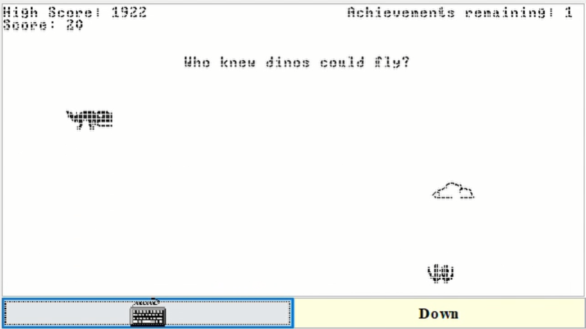
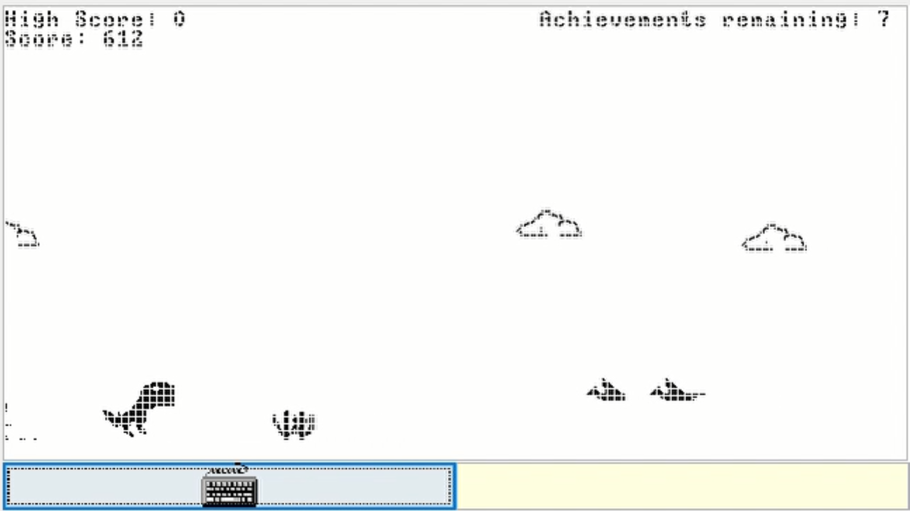
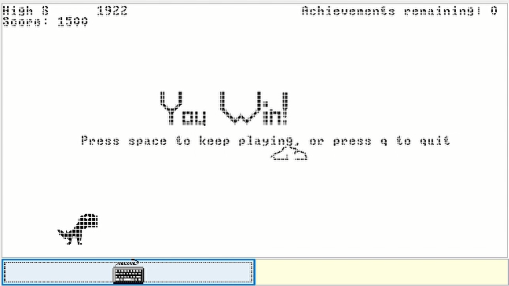

# DinoAdventure

## Description
Mostly like the classic Chrome dino game, but with powerful "glitches" and features that make the game more fun, as well as achievements that give the game an ending.

## Usage
Download the software package from nand2tetris (https://www.nand2tetris.org/software)
Also download all the files from vm_code, to a single directory of your choice. Then, in the VMEmulator, choose to open files, and select the entire directory where the .vm reside. Finally, switch 'Animate' to 'No Animation' and click run.

## How to Play
The goal of the game is to run as far, scoring points based on distance, and to complete achievements. You win once you have completed all achievements and are beyond 1500 points.
Use space bar or up arrow keys to jump, down arrow to crouch (and exit from a jump), and q to quit. There are several hidden features, so try different keys to discover them;
these features are necessary for completing certain achievements and make it easier to progress in the game. 
Note: obstacle placement is generated mostly randomly, so there are some maps that are impossible to progress in; in this case, simply restart for a new random layout.

## Demo of features/achievements
https://youtu.be/zXWyuDh928o
(Warning, do not watch if you want to discover the hidden features yourself)

## Why you should play this
There are glitches that turned into features

A different, random map is generated each game

It is challenging, yet doable 

## Aknowledgements
https://github.com/N2Tstud3nt/nand2tetris-project09-Flappy-Bird  (for Linear Congruential Generator implementation on Hack, and general game ideas)
